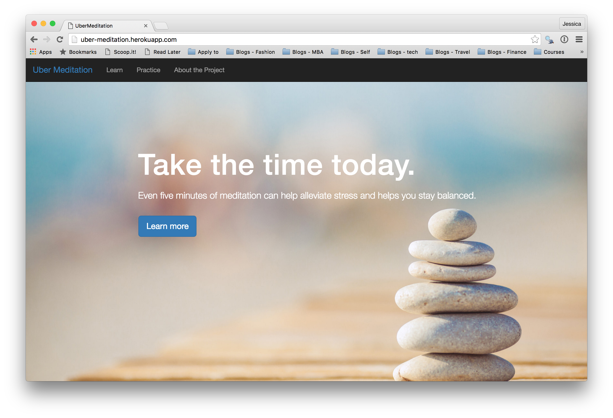

# Uber Meditation

This web application was implemented for Uber's People Development Technology Exercise coding challenge.

It is an app for Uber employees to learn different meditation techniques and practice meditation with the help of a timer. 

## Architecture
This application uses Rails and Postgresql to implement a simple back-end. The frontend utilizes React.js and Rails views.  

##Demo
Check out the app [here](https://uber-meditation.herokuapp.com/).

##Software used
* Ruby on Rails
* React.js
* Bootstrap SASS
